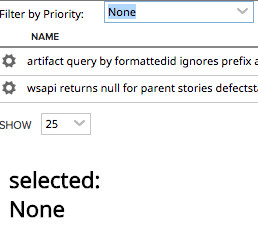
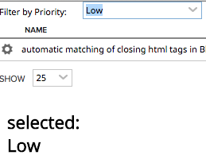

Container Example
=========================

## Overview

The exmple shows how different ui components are added to containers and how an html property of component is updated

This app is vailable AS IS. It is NOT supported by Rally.
## License

AppTemplate is released under the MIT license.  See the file [LICENSE](./LICENSE) for the full text.

##Documentation for SDK

You can find the documentation on our help [site.](https://help.rallydev.com/apps/2.0/doc/)
